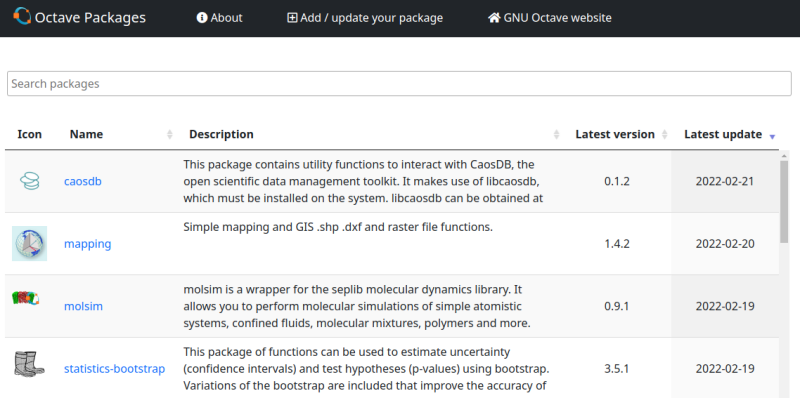

# GNU Octave - Package Extensions Index

Extend [GNU Octave](https://www.octave.org)'s functionality by
[packages](https://octave.org/doc/v5.2.0/Creating-Packages.html).

> <https://gnu-octave.github.io/pkg-index/>

- All packages can be installed by the
  [`pkg install`](https://octave.org/doc/v5.2.0/Installing-and-Removing-Packages.html)
  command.

- **Easily share your code** (Octave, C/C++, or FORTRAN) as package.

  > [**Learn how build and add your package**](CONTRIBUTING.md)

- Want to use this index for your **own package manager**?

  > [**Learn more**](doc/development.md)

- This is a **superset of**
  [**Octave Forge**](https://octave.sourceforge.io/).
  All packages in their latest release are indexed here.
